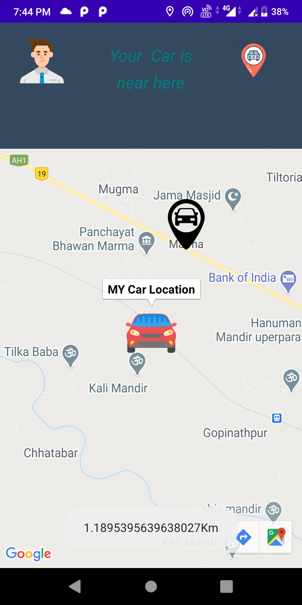
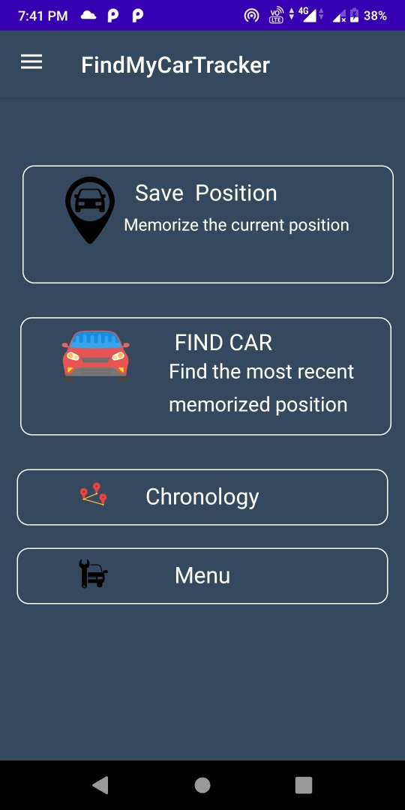

# FindMyCar

**Download the App**:https://play.google.com/store/apps/details?id=com.masai_technology.findmycar

FindMyCar is an Android App that basically find the exact Location of your car and you and it also shows you the distance between you and your car.
You can also see the past position of your car through this app.

# Screenshots

# Libraries this app uses
###### Google Play Services-maps/Location - 'com.google.android.gms:play-services-maps:17.0.0'/implementation 'com.google.android.gms:play-services-location:17.0.0'

###### Karumi-Dexter - implementation 'com.karumi:dexter:5.0.0'

###### Maps-Utils - implementation 'com.google.maps.android:android-maps-utils:2.2.0'

###### FireBase -  implementation 'com.google.firebase:firebase-database:19.5.1'

# Permissions
###### Full Network Access
###### Full Access Location

